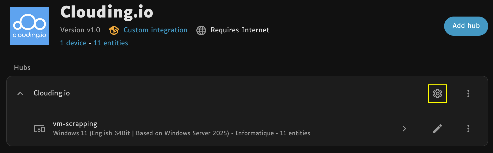
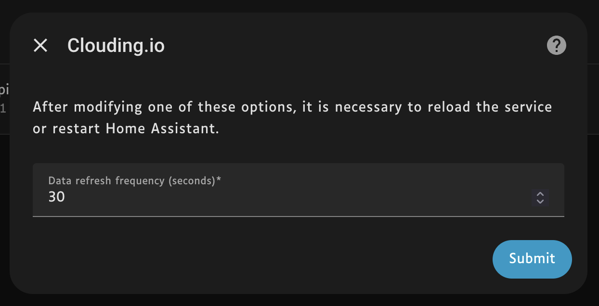

## How do I configure the refresh frequency?

### Configure the service (recommanded solution)

On the Clouding.io Integration page (_/config/integrations/integration/clouding_), configure your service.

In the pop-up window, enter the desired `Data refresh rate` value in seconds.

